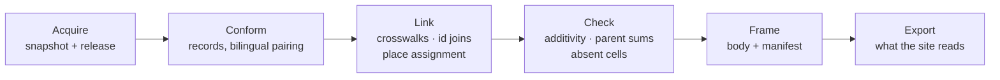

# REBUILD — the backend, rebuilt from shells

_Written 2026-09-17. Status: **plan, for the owner's review. No code is written until it is approved.**_

The legacy atlas is frozen as the tag **`legacy-v1`** (`ecf6ca9`). It is the
answer key: every number the rebuild produces is checked against it. Its code
is not carried forward. This file is the whole plan; it replaces the five
"what next" documents for the rebuild (`PLAN.md`, `ROADMAP.md`, `PROGRAM.md`,
`BACKLOG.md`, and `STATUS.md`'s queue), which stay as history.

The rebuild happens **in this repository**. It borrows the *shape* of the
Athena Data design (shells, frames, dataset cards) so that its pieces could move
later, but it depends on nothing outside this repository.

---

## 1. Why the legacy structure sprawled

Measured at `legacy-v1`.

| Symptom | Evidence |
| --- | --- |
| **Stages are features, not steps** | 9 stages (`01_projects` … `08_provinces`, `99_bundle`). Each fetches, parses, checks, shapes and writes. `08_provinces` reads four publishers. |
| **Hidden dependencies** | `06_industries` reads `01`'s `projects.json`; `99_bundle` reads everything. Order is kept only by the file numbering. |
| **The same job, several times** | Stages 02, 03 and 08 each download Statistics Canada tables themselves. |
| **Half-validated configuration** | 10 files in `registry/`; `registry.py` loads five of them. The rest are read directly by whichever script uses them. |
| **No common output** | Every output file has its own layout, so `schema.py` has 22 classes and `bundle.ts` 38 hand-written types mirroring them. |
| **Datasets with no screen** | Nominal GDP, capex, employment, gross output, municipalities and the vessel register are produced and never bundled. |
| **The bundle copies `data/`** | 10 of the 13 bundle files are byte-identical copies of files under `data/`. |
| **Derived bytes in git** | 44,280,521 bytes of geometry in `web/public/geo/` (`rail.json` alone is 16,533,231). |
| **Planning outweighs checking** | 5,275 lines of documents against 10,783 lines of backend Python; five documents each answer "what next?". |
| **An untested extension claim** | "A second event with no change in `web/`" was the structure's promise and was never tried. |

**Root cause:** the atlas grew by adding a stage per request. The rebuild gives
it a fixed model to grow inside: **the project declares datasets; shells run
operations on them.**

What carries forward is knowledge, not code: the invariants in `CLAUDE.md`, the
"things that fail silently" list, the validated numbers, and the raw snapshots
already on disk.

---

## 2. The model

### 2.1 Six kinds of record

Every dataset is made of these, and nothing else. A source that needs a seventh
is a design discussion, not a patch.

| Record | What it is | Legacy examples |
| --- | --- | --- |
| **Place** | An identity with a type, a parent and a boundary vintage | Provinces, census subdivisions |
| **Observation** | A published number about a place in a period, with its release, unit, scalar and flags | GDP, sector shares, fiscal columns, business counts |
| **Asset** | A physical thing at coordinates, with dated attributes | MPO sites, NRCan inventory entries |
| **Event** | A dated happening with a declared date precision | MPO project updates |
| **Passage** | Verbatim text with its document, locator and hash | Project descriptions, budget quotes, mottos |
| **Media** | A file with its own licence and artist | Renderings, flags, coats of arms |

Every value carries **provenance** (`official_dataset`, `page_verbatim`,
`derived`, …), its **release**, and its **source snapshot**. Unpublished is not
zero.

### 2.2 Frames

Every step emits a **frame**: a body plus a manifest. The manifest declares the
profile, keys, each column's type, unit and **role** (entity, time, measure,
category, slice, status, label, geometry reference, source reference), the
releases used, the checks that ran, and what consumes it.

Five profiles cover the atlas:

| Profile | Required roles | Atlas use |
| --- | --- | --- |
| **panel** | entity, time, measure | GDP, sector shares, fiscal tables, policy rate |
| **cross-section** | entity, measure | Business counts, industry assignments |
| **points** | entity, geometry reference | Project sites, inventory entries |
| **events** | entity, time, category | Project updates |
| **passages** | entity, label, source reference | Descriptions, budget quotes, mottos |

The web app reads frames through **one reader**. The 38 hand-written types go.

### 2.3 Shells

A **shell** is one operation with a written card, built and tested on its own.
Three kinds:

- **Acquire:** source → snapshot → frame. The only code that touches the network.
- **Transform:** frame(s) → frame. Pure functions: no clock, no network, no hidden state.
- **View:** frame → screen.

**Every shell card is written and approved before its code.** It uses the same
fields as an Athena Data shell card, so a card could move there unchanged:

`layer` · `contract` · `shapes` · parameters · declared **invariants** ·
**refusals** · **benchmark** (a legacy number it must reproduce) · `limits` · `gotchas`

A declared invariant becomes a test. A benchmark is a number from `legacy-v1`.

---

## 3. One pipeline for every dataset



A **dataset card** names the chain. Adding a dataset means adding a card, and a
shell only if no existing one fits. A run writes a **receipt**: the named values
it produced, which `verify/` compares against the card and the answer key.

---

## 4. The atlas, decomposed

**Legend.** Each step is a shell, or **project** code (genuinely atlas-only), and
every dataset names its **benchmark** from `legacy-v1`.

### Economy

| Dataset | Chain | Profile | Benchmark |
| --- | --- | --- | --- |
| National monthly GDP, chained + constant 2017 | `statcan-table` → `pair-bilingual` → `check-additivity` (constant basis; the chained basis must drift, +0.311%, as its negative control) | panel, price basis as a slice | 8,142 chained + 8,142 constant cells |
| Provincial annual GDP | `statcan-table` → `pair-bilingual` | panel | 8,671 cells |
| Sector shares, 36-10-0400 | `statcan-table` → `pair-bilingual` | panel | 7,917 cells |
| Business counts, newest table by title | `statcan-table` → `pair-bilingual` → `resolve-absent` | cross-section, size range as a category | 2,512 matched, 260 absent |
| Bank of Canada policy rate | `valet-series` | panel | `data/sectors/rates.json` at `legacy-v1` |

### Public finance

| Dataset | Chain | Profile | Benchmark |
| --- | --- | --- | --- |
| Fiscal Reference Tables | `workbook-edition` (the edition is found by downloading and checking the body is a workbook) → `pair-rows` (English and French paired by position with a tolerance, never on the year label) → basis `actual`, fiscal years with start and end dates | panel | 3,998 cells |

### Province pages

| Dataset | Chain | Profile | Benchmark |
| --- | --- | --- | --- |
| Budget passages | `document-passage` (checked verbatim at its page) | passages | 13 quotes |
| Mottos and flag descriptions | `document-passage` (HTML locator) | passages | legacy `provinces.json` |
| Flags and coats of arms | `media-capture` (per-file licence and artist) | media | 26 images |
| **The province page** | **project** view composing the frames above with provincial GDP and shares | — | walkthrough in both languages |

### Major projects and geography

| Dataset | Chain | Profile | Benchmark |
| --- | --- | --- | --- |
| Census subdivisions 2021 | `statcan-table` → `pair-bilingual` → places → `parent-sum` (2021 must sum to each province; 2016 must not for NL, QC and ON, as the negative control) | places | 5,161 subdivisions |
| Boundaries | `boundary-tiers` (download, simplify to detail tiers; built, not committed) | geometry | legacy geometry, compared as parsed content |
| MPO sites | `arcgis-layer` (English and French paired); corridor midpoints labelled derived | points | 18 projects with sites |
| MPO pages | **project:** MPO page parser (doubled blocks, `data-bgimg` hero) → `document-passage` | passages, events | bilingual text; update history |
| NRCan status and capital cost | `arcgis-layer` → `join-by-id` (declared id pairs, checked by distance; never totalled) | points | 9 of 9 costs |
| Industry assignments | `crosswalk` (each assignment carrying its StatCan quote, checked at its locator) | cross-section | legacy `industries.json` |
| Project → province | `assign-place` (by boundary vintage) | — | legacy province per site |
| **Project map and viewer** | **project** views | — | every project reachable (18 of 18) |

### Parked, each with its reason

| Legacy output | Why |
| --- | --- |
| Nominal GDP, capex, employment (SEPH), gross output | No screen uses them. SEPH is ~1 GB of CSV per language. |
| Vessel register + live AIS | A live feed has no publisher release; it needs its own rule before it returns. |
| Nine transformative strategies | Dropped at close-out (B7), yet still bundled. **Owner decision Q3.** |
| Trade corridors | Never discussed at close-out. **Owner decision Q3.** |
| Rail, highways, national highway system, water, places layers | Return with a road-and-rail dataset card, not before. |

---

## 5. The shells

**Acquire**

| Shell | Contract | Benchmark |
| --- | --- | --- |
| `statcan-table` | Download a full table in both languages; follow its release; refuse a table whose declared columns moved | Every economy panel |
| `valet-series` | One Bank of Canada series with its observation dates | Policy rate |
| `workbook-edition` | Find the newest published edition of a workbook by content, not by a HEAD request | Fiscal tables |
| `arcgis-layer` | Query a map-service layer in English and French and pair the features | MPO sites, NRCan inventory |
| `document-passage` | Capture a passage from a PDF or HTML page and prove it is there, verbatim, at its locator | Budget quotes, mottos, MPO text |
| `media-capture` | Store an image with the licence and artist recorded for that file | Flags and arms |
| `boundary-tiers` | Download a boundary file and produce declared detail tiers with their vintage | Boundaries |

**Transform and check**

| Shell | Contract | Invariants and refusals | Benchmark |
| --- | --- | --- | --- |
| `pair-bilingual` | Join English and French labels by code | Row count unchanged; refuses an unmatched code | Every StatCan table |
| `pair-rows` | Pair two renderings by position, values within a tolerance | Refuses different row counts; reports every label mismatch | 3,998 fiscal cells |
| `check-additivity` | Parts equal their declared whole within a tolerance | Chained dollars must fail it | National constant GDP |
| `parent-sum` | Children of an additive measure equal the published parent | Refuses rates and chained dollars | 2021 census counts |
| `resolve-absent` | An absent cell becomes zero only when the published total proves it | Never invents a key | 2,512 / 260 |
| `crosswalk` | Map codes through a declared, evidenced table | Every row mapped or refused; output labelled derived | Industry assignments |
| `join-by-id` | Join two asset frames through declared id pairs, checked by distance | Never matches by name; a waiver must be named | 9 of 9 costs |
| `assign-place` | Assign each point to its containing place at a boundary vintage | Moving a point across a boundary changes exactly two counts; reordering changes nothing | Legacy province per site |
| `derive-ratio` | A stated ratio of two frames with matching keys and periods | Labelled derived; refuses mismatched units | Extension test (§7) |
| `like-with-like` | Before two values share an axis: unit, scalar, price basis, fiscal basis, period, vintage, status | Passes, annotates or refuses | Alberta vs Ontario |

**View**

| Shell | Profile | Notes |
| --- | --- | --- |
| `series` | panel | Crosshair, table twin |
| `choropleth` | panel, cross-section | Time slider |
| `ranked-bars` | cross-section | Sorts published values; never a ranking of ours |
| `timeline` | events | Displays the published date string |
| `pin-map` | points | One marker per record, exhaustively; a new geometry kind fails the build |
| `table-twin`, `provenance-panel` | any | **On every view, no exceptions** |

---

## 6. Repository layout after the rebuild

```
registry/
  sources/      one card per source: access, terms read and dated, gotchas
  datasets/     one card per dataset: source, chain, release rule, profile, roles, checks, consumer
  crosswalks/   MPO → NAICS, IOIC → NAICS; every entry with its quoted evidence
  shells/       one card per shell, approved before its code
  views/        which frames each view shows
cea/            the package (a new name, so nothing from legacy `atlas/` is imported by accident)
  records/      the six records, provenance, releases, the frame envelope
  store/        content-addressed snapshots and dataset editions
  shells/       acquire/, transform/, check/ — one module per shell card
  project/      atlas-only code: the MPO page parser
  run.py        runs a dataset card and writes its receipt
verify/         independent of cea/; parity against legacy-v1; the sabotage list
web/            one frame reader, the view shells, the project views
data/           gitignored except the small export the site reads
```

- **Raw snapshots** move from `data/raw/` into the content-addressed store. They
  are never committed.
- **Geometry** is built, not committed. The site's CI builds it from the source
  downloads, or the export carries only what the site needs. **Owner decision Q5.**

---

## 7. Verification

1. **Parity with `legacy-v1`.** `verify/parity.py` reads the tag through
   `git show legacy-v1:<path>`. It is the **only** code allowed to read the answer
   key. An import scan fails the build if anything under `cea/` references it,
   and that scan carries a planted reference it must catch.
2. **Every check has a negative control**: a deliberate defect it must refuse.
3. **Sabotage list.** Each gate names patches that must defeat it; CI applies
   them to a scratch copy and requires the gate to fail.
4. **Receipts name members, not just counts.** For example, "unmatched codes: 11
   and 111", not "2 unmatched".
5. **Re-running changes nothing.** A second run leaves a zero-line diff and the
   same content hashes.
6. **Every number in a document or pull request comes from command output** in
   the same change.
7. **One pull request per step**, with its file radius stated in the description.
   CI runs the tests, `verify/` and parity. The owner merges from the parity
   report. How much machinery this needs (a light radius check, or the full
   sealed-test gate) is **owner decision Q6**.

---

## 8. Order of work

| Step | Content | Done when |
| --- | --- | --- |
| **R1 Foundation** | Records, frames, store, `run.py`, one registry validator, the `verify/` harness with parity and the import scan; shell cards for R2 approved | The validator refuses an unknown file; the planted answer-key reference is caught |
| **R2 Economy** | The five economy datasets | Parity: 8,142 + 8,142, 8,671, 7,917, 2,512/260, policy rate |
| **R3 Public finance** | Fiscal Reference Tables | Parity: 3,998 cells; no join on year labels |
| **R4 Province pages** | Passages, media, the page | Every passage found verbatim; 26 images with licences; walkthrough in both languages |
| **R5 Major projects and geography** | Places, boundaries, sites, pages, inventory, industries, place assignment, map and viewer | 18 of 18 reachable; 9 of 9 costs; 5,161 subdivisions summing to every province |
| **R6 Ship** | Site back on GitHub Pages; the daily build re-enabled for what remains live; legacy code removed from `main` | Owner signs off the parity report |
| **R7 Extension test** | Population, GDP per capita (a derived ratio) and one health indicator by province; Alberta vs Ontario over time | **Only dataset cards and view configuration change.** If code has to change, the structure is wrong, and a finding says why. |

Each step is one pull request or a short series of them. Nothing in a later step
starts before the earlier one's parity is signed off.

---

## 9. Rules that stop the sprawl coming back

1. **No dataset without a consumer**, or a declared reason for having none.
2. **A request names its profile first.** A new record kind or profile is a design discussion.
3. **Stages are operations.** Nothing is named after a feature.
4. **One validator reads all configuration** and refuses unknown files and fields.
5. **One envelope.** No hand-mirrored types.
6. **One queue: this file.** STATUS is generated from receipts.
7. **Derived bytes stay out of git.**
8. **Rendering a collection is a total function** (`CLAUDE.md` §2b), now a view-shell invariant.

---

## 10. Decisions for the owner

| # | Question | Lean |
| --- | --- | --- |
| **Q1** | First edition: the recentred core in §4, or parity with everything legacy ships? | The core |
| **Q2** | Live vessel tracking: park it until a live-feed rule exists? | Park it |
| **Q3** | Strategies and trade corridors: keep or park? | — |
| **Q4** | When does legacy code leave `main`: at R1 (the tag keeps it) or at R6? | At R1, so nothing is ported by accident; the site stays dark until R6 |
| **Q5** | Geometry for the site: built in CI from downloads, or a small committed export? | Built in CI, with a cache |
| **Q6** | Gate weight: a light radius check per pull request, or the full sealed-test gate? | Light now; the full gate if a check is ever bypassed |
| **Q7** | Package name `cea`? | `cea` |
| **Q8** | The uncommitted `docs/TESTS.md` notes in the main checkout: keep as history or drop? | Drop; the tests they describe are not carried |
